###Open Source Definition:
These rules are important because they allow the most ammount of people to contribute to a project. The more people working on a project the faster bugs are removed and features created.

###Smart Questions:
Have you used al relevant tools such as debuggers to help fix your issue?
Walk through each step of your issue first and double check.

###Free Culture Paragraph:
It can be difficult to determine who owns what. If we develope something, we should consider what the wider implications of our technologies are. Those people or companies with power may end all our work in in instant. While we might not actaully be breaking the law we must take every effort to protect ourselves. We need to create safeguards to prevent unwanted use of our systems. People like Jesse have the best intentions when they create their work. While almost no hard was actually caused by his search engine, powerful organizations worked to take all he had. We need to be careful with the software we create.

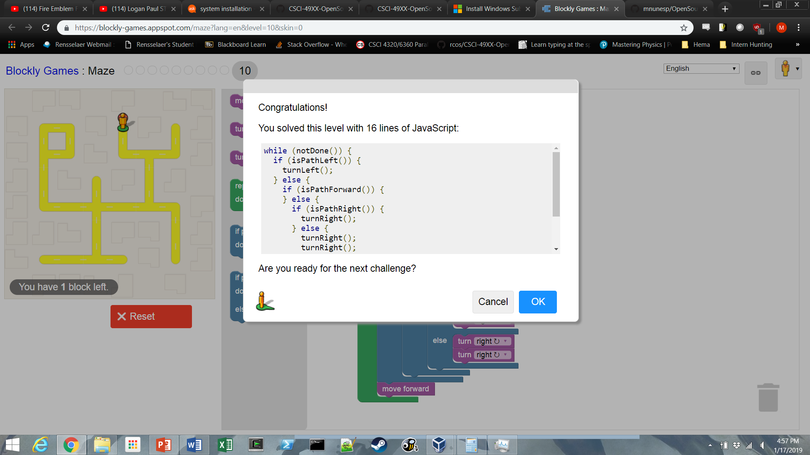
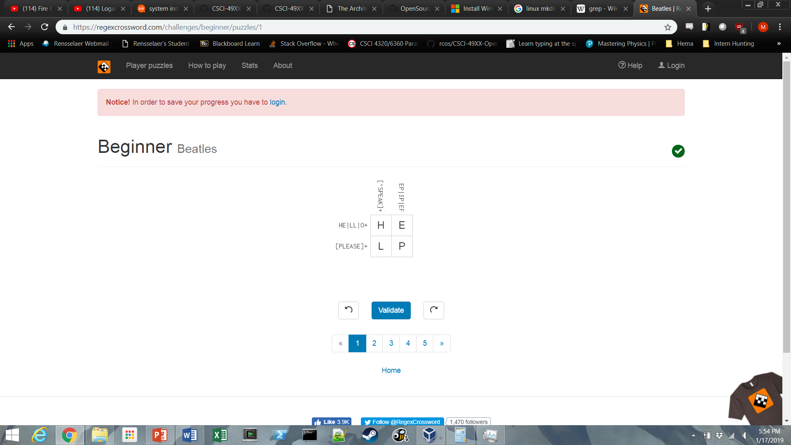
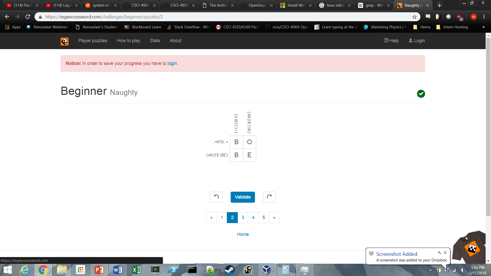

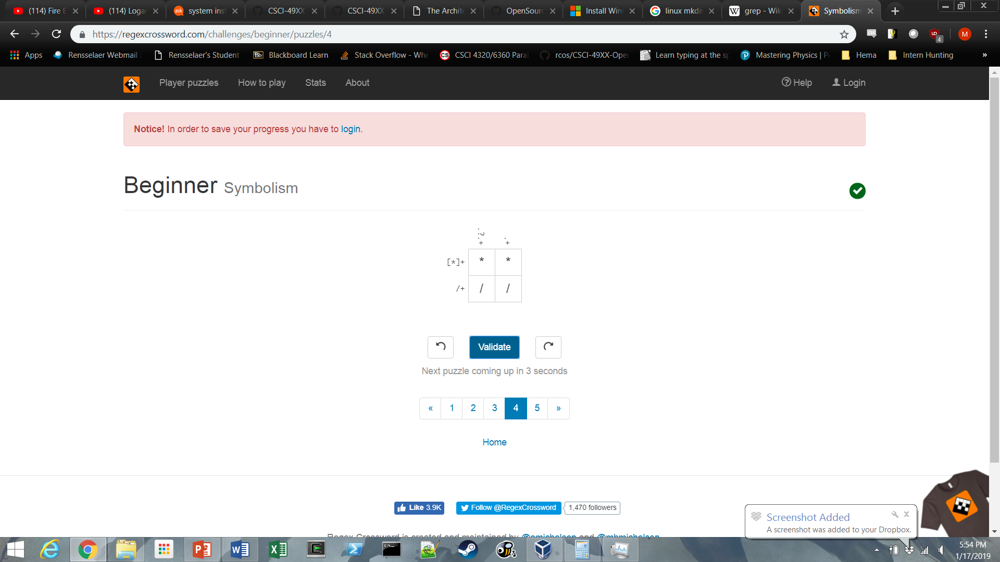
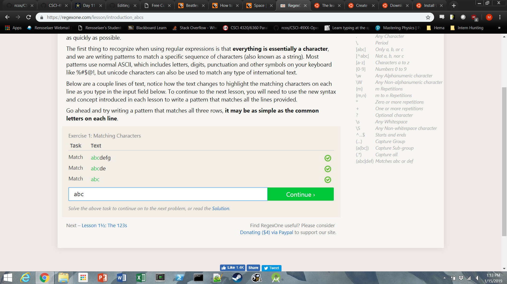
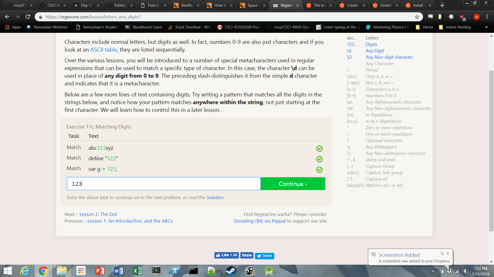
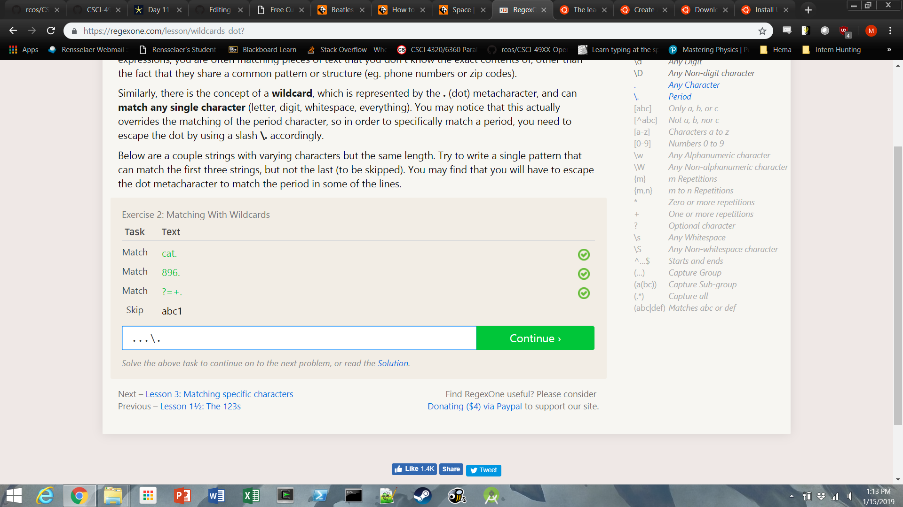
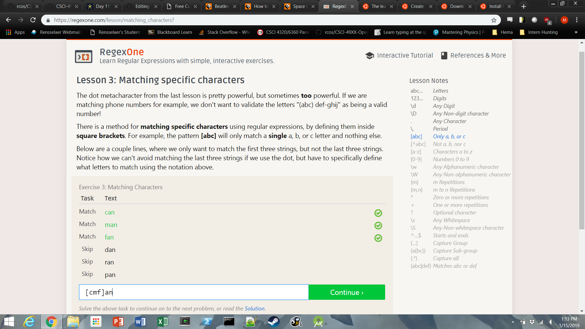
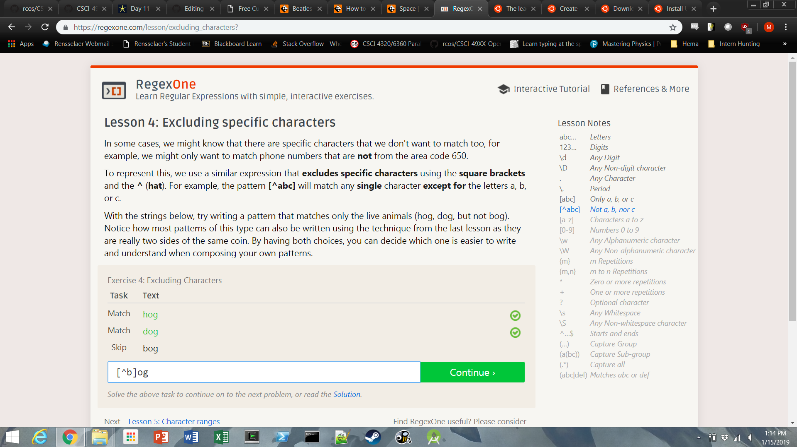
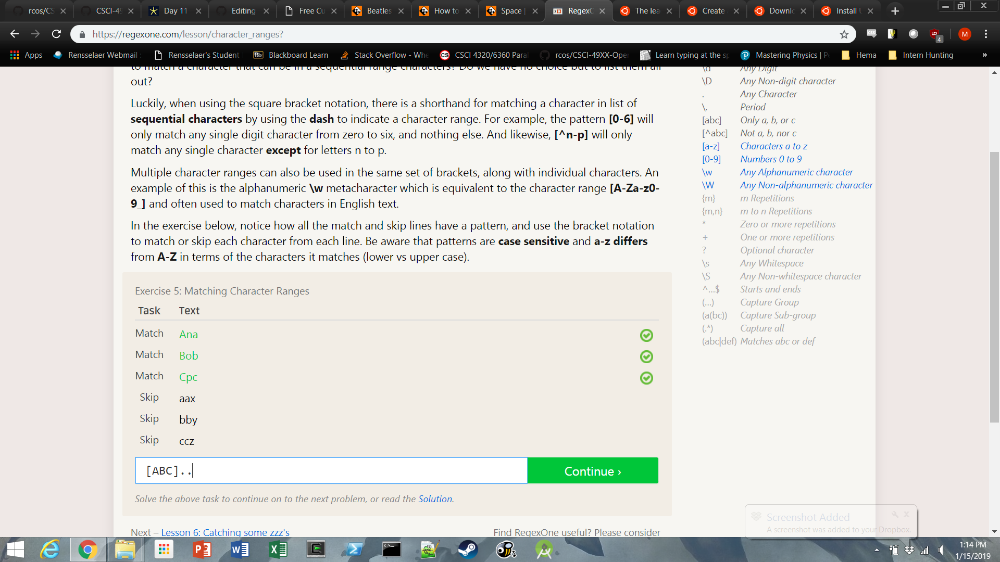
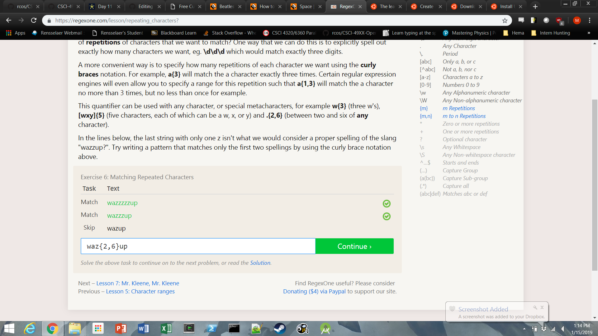
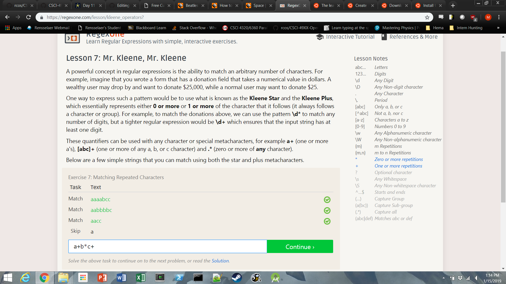

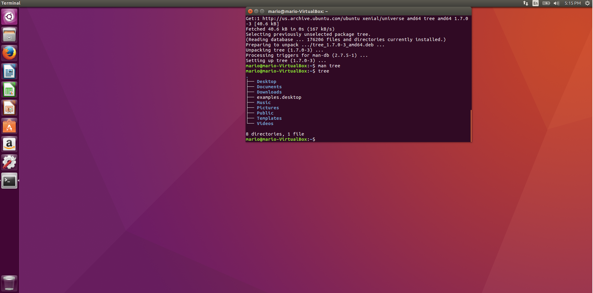
